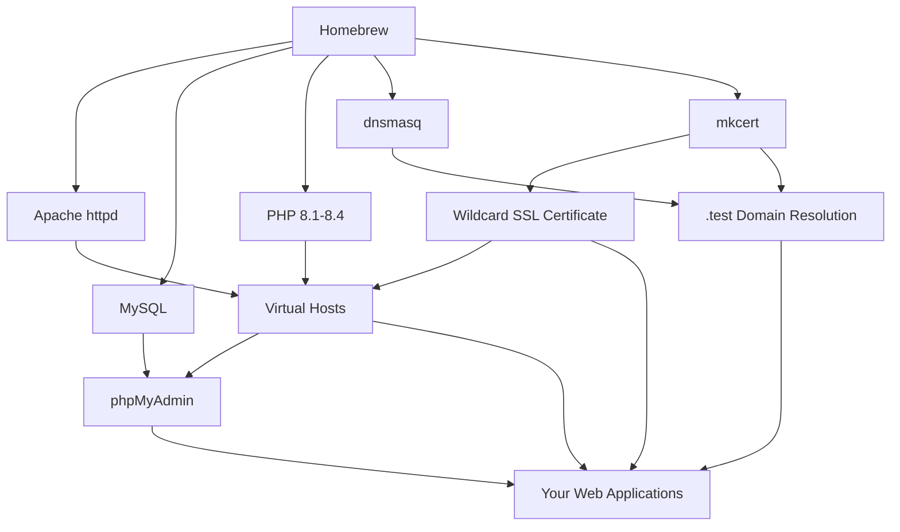

# 🍺 BAMP - Brew + Apache + MySQL + PHP

**A fully automated, lightweight, and professional MAMP Pro alternative for macOS.**

[](https://opensource.org/licenses/MIT)
[](https://www.apple.com/macos/)
[](https://brew.sh/)

> **BAMP** = **B**rew + **A**pache + **M**ySQL + **P**HP
> A transparent, reproducible, and fully controllable local development environment.

---

## ✨ Why BAMP?

**MAMP Pro Problems:**
- 💰 Expensive licensing
- 🔒 Closed-source and opaque
- 🗂️ Messy file organization
- 🐌 Resource-heavy and bloated
- 🔧 Limited customization options

**BAMP Solutions:**
- ✅ **100% Free & Open Source** - MIT licensed
- ✅ **Transparent Setup** - Every step is visible and customizable
- ✅ **Lightweight** - Only installs what you need
- ✅ **Professional Grade** - Real SSL, proper DNS, enterprise features
- ✅ **Team Friendly** - Reproducible across development teams
- ✅ **Clean Uninstall** - Complete removal when no longer needed
- ✅ **Complete Ecosystem** - Full suite of management tools

---

## 📦 Installation Options

### Option 1: One-Command Install (Recommended)

```bash
# Download and install globally
curl -fsSL https://raw.githubusercontent.com/amitdugar/bamp/main/install.sh | bash
```

```bash
# Now use anywhere:
bamp 8.4                    # Install/switch PHP version
bamp-vhost myapp /path      # Create virtual host
bamp-mysql list             # List databases
bamp-uninstall              # Remove BAMP
```

**Benefits:**
- ✅ **Zero dependencies** - No git required
- ✅ **One command** - Download and install instantly
- ✅ **Global commands** - Use `bamp` from anywhere
- ✅ **Auto PATH setup** - Handles shell configuration

### Option 2: Manual Download

```bash
# Download individual scripts
curl -O https://raw.githubusercontent.com/amitdugar/bamp/main/bamp.sh
curl -O https://raw.githubusercontent.com/amitdugar/bamp/main/bamp-vhost.sh
curl -O https://raw.githubusercontent.com/amitdugar/bamp/main/bamp-mysql.sh
curl -O https://raw.githubusercontent.com/amitdugar/bamp/main/bamp-uninstall.sh

# Make executable and use
chmod +x bamp*.sh
bamp 8.4
```

### Option 3: Git Clone (For Developers)

```bash
# Clone for development/contribution
git clone https://github.com/amitdugar/bamp.git
cd bamp
./install.sh              # Install globally
# Or use directly: bamp 8.4
```

### Option 3: Manual PATH Setup

```bash
# Add to your shell profile (~/.zshrc or ~/.bash_profile)
export PATH="$HOME/path/to/bamp:$PATH"

# Create symlinks without .sh extension
ln -s $(pwd)/bamp.sh ~/bin/bamp
ln -s $(pwd)/bamp-vhost.sh ~/bin/bamp-vhost
ln -s $(pwd)/bamp-mysql.sh ~/bin/bamp-mysql
ln -s $(pwd)/bamp-uninstall.sh ~/bin/bamp-uninstall
```

---
## 🔄 Updating BAMP

To update to the latest version, simply re-run the installer:

```bash
# Download and install globally
curl -fsSL https://raw.githubusercontent.com/amitdugar/bamp/main/install.sh | bash
```

## 🚀 Features

### Core Stack
- 🍺 **Homebrew-powered** - Clean, manageable installations
- 🌐 **Apache (httpd)** - Production-grade web server
- 🐘 **Multiple PHP Versions** - 8.1, 8.2, 8.3, 8.4 with instant switching
- 🗄️ **MySQL** - Full-featured database server with professional configuration
- 🎵 **Composer** - PHP dependency manager
- 🔧 **phpMyAdmin** - Web-based MySQL administration

### Development Features
- 🔐 **Auto SSL** - Trusted wildcard certificates via mkcert (`*.test`)
- 🌍 **DNS Resolution** - `*.test` domains work automatically
- 📁 **Virtual Hosts** - Easy site management with SSL
- 🔧 **Dev-Optimized** - Error display, proper logging
- 📊 **Status Dashboard** - Monitor all services
- 🔄 **Service Management** - Start, stop, restart with ease

### Professional Database Tools
- 📥 **Import/Export** - SQL and compressed SQL.GZ support
- 💾 **Automated Backups** - Timestamped, compressed dumps
- 🔐 **Security Management** - Password reset and configuration
- 🔧 **Maintenance Tools** - Optimize, check, and repair databases
- 📊 **Database Analytics** - Size reporting and table statistics

### Enterprise Features
- 📋 **Comprehensive Logging** - Apache logs per virtual host
- 💾 **Backup System** - Safe configuration changes
- 🎯 **Dry-Run Mode** - Preview changes before applying
- 🧹 **Clean Uninstall** - Complete removal with backups
- 📖 **Full Documentation** - Detailed help and examples

---

## 📦 Complete Toolkit

BAMP provides a complete suite of professional tools:

| Script | Purpose | Key Features |
|--------|---------|--------------|
| `bamp.sh` | **Core Installation** | Install stack, switch PHP versions, service management |
| `bamp-vhost.sh` | **Virtual Hosts** | Create SSL-enabled sites, domain management |
| `bamp-mysql.sh` | **Database Operations** | Import/export, backups, maintenance, security |
| `bamp-uninstall.sh` | **Safe Removal** | Complete cleanup with backup options |

---

## 📦 Quick Start

### 1. Install BAMP Stack

```bash
bamp.sh 8.4
```

**What this does:**
- Installs/updates Homebrew
- Installs Apache, MySQL, PHP, and dependencies
- Installs phpMyAdmin for database management
- Configures Apache with proper settings
- Sets up SSL certificate authority with wildcard `*.test` certificates
- Configures DNS for `.test` domains
- Creates default MySQL configuration
- Interactive MySQL security setup
- Creates sample PHP info page

### 2. Create Your First Site

```bash
# Interactive mode
bamp-vhost

# Command-line mode
bamp-vhost myapp /Users/yourname/web/myapp/public
```

**Results:**
- ✅ `myapp.test` domain configured
- ✅ HTTP: `http://myapp.test`
- ✅ HTTPS: `https://myapp.test` (trusted SSL via wildcard certificate)
- ✅ Apache restarted automatically

### 3. Manage Your Databases

```bash
# List all databases with sizes
bamp-mysql list

# Import a database
bamp-mysql import myapp production_backup.sql

# Export with compression
bamp-mysql dump-gz myapp backup.sql.gz

# Backup all databases
bamp-mysql dump-all ~/backups/
```

### 4. Monitor Your Environment

```bash
# Check service status
bamp --status

# List all virtual hosts
./bamp-vhost.sh --list

# MySQL status and configuration
./bamp-mysql.sh status

# Switch PHP versions
bamp 8.4

# Restart all services
bamp --restart
```

---

## 📚 Detailed Usage

### BAMP Core Management

```bash
# Installation and PHP switching
bamp                    # Install with default PHP 8.2
bamp 8.2               # Install/switch to PHP 8.2
bamp --help            # Show all options

# System management
bamp --status          # Show service status
bamp --list            # List available PHP versions
bamp --restart         # Restart all services
```

### Virtual Host Management

```bash
# Create virtual hosts
./bamp-vhost.sh                           # Interactive mode
./bamp-vhost.sh myapp /path/to/public     # Command-line mode
./bamp-vhost.sh -d local myapp /path      # Use .local domain
./bamp-vhost.sh --dry-run myapp /path     # Preview only

# Manage existing hosts
./bamp-vhost.sh --list                    # List all virtual hosts
./bamp-vhost.sh --remove myapp            # Remove virtual host
./bamp-vhost.sh --help                    # Show all options
```

### Database Operations

```bash
# Import operations
./bamp-mysql.sh import myapp backup.sql           # Import SQL file
./bamp-mysql.sh import-gz staging prod.sql.gz    # Import compressed file

# Export operations
./bamp-mysql.sh dump myapp                        # Export to timestamped file
./bamp-mysql.sh dump-gz myapp backup.sql.gz      # Export with compression
./bamp-mysql.sh dump-all ~/backups/              # Backup all databases

# Database management
./bamp-mysql.sh list                              # List databases with sizes
./bamp-mysql.sh create newproject                # Create database
./bamp-mysql.sh drop oldproject                  # Drop database (with confirmation)

# Service management
./bamp-mysql.sh restart                           # Restart MySQL
./bamp-mysql.sh reset-password                   # Reset root password
./bamp-mysql.sh status                           # Show MySQL status

# Maintenance
./bamp-mysql.sh optimize myapp                   # Optimize database tables
./bamp-mysql.sh check myapp                      # Check and repair tables
```

### Safe Uninstallation

```bash
# Safe removal with backups
./bamp-uninstall.sh

# Advanced options
./bamp-uninstall.sh --dry-run            # Preview what will be removed
./bamp-uninstall.sh --keep-data          # Keep databases
./bamp-uninstall.sh --no-backup          # Skip backups
./bamp-uninstall.sh --force              # Skip confirmations
```

---

## 🔧 Configuration

### Default Settings

| Service | Port | Location |
|---------|------|----------|
| Apache HTTP | 80 | `http://localhost` |
| Apache HTTPS | 443 | `https://localhost` |
| MySQL | 3306 | `mysql -u root` |
| phpMyAdmin | - | `http://localhost/phpmyadmin` |
| Document Root | - | `/Users/yourname/web` |

**Custom Port Configuration:**
```bash
# Use custom ports if 80/443 are in use
BAMP_HTTP_PORT=8080 BAMP_HTTPS_PORT=8443 ./bamp.sh

# Or for virtual hosts
BAMP_HTTP_PORT=8080 BAMP_HTTPS_PORT=8443 ./bamp-vhost.sh myapp /path

# Set for entire session
export BAMP_HTTP_PORT=8080
export BAMP_HTTPS_PORT=8443
export BAMP_MYSQL_PORT=3306
./bamp.sh
```

**Why Standard Ports?**
- ✅ **Professional URLs** - Clean URLs without port numbers
- ✅ **Production-like** - Matches real web server configurations
- ✅ **Team Friendly** - Consistent across development environments
- ✅ **Flexible** - Easy override when ports are occupied

### Important Paths

```bash
# Apache
${BREW_PREFIX}/etc/httpd/httpd.conf              # Main Apache config
${BREW_PREFIX}/etc/httpd/extra/httpd-vhosts.conf # Virtual hosts
${LOG_DIR}                    # Apache logs

# PHP
${BREW_PREFIX}/etc/php/8.2/php.ini               # PHP configuration
${BREW_PREFIX}/opt/php@8.2/                      # PHP installation

# MySQL
${BREW_PREFIX}/etc/my.cnf                        # MySQL configuration
${BREW_PREFIX}/var/mysql/                        # Database files

# SSL Certificates
${BREW_PREFIX}/etc/httpd/certs/                  # SSL certificates
~/.mkcert/                                       # mkcert CA files
```

### MySQL Configuration

BAMP creates a professional MySQL configuration with development-friendly defaults:

```ini
# /opt/homebrew/etc/my.cnf
[mysqld]
# Balanced sql_mode (removes STRICT_TRANS_TABLES for convenience)
sql_mode = "ONLY_FULL_GROUP_BY,ERROR_FOR_DIVISION_BY_ZERO,NO_AUTO_CREATE_USER,NO_ENGINE_SUBSTITUTION"

# UTF8MB4 support
character-set-server = utf8mb4
collation-server = utf8mb4_0900_ai_ci

# Performance settings optimized for local development
max_connections = 200
innodb_buffer_pool_size = 256M
query_cache_type = 1
query_cache_size = 64M
```

**To customize:**
```bash
# Edit configuration
sudo nano ${BREW_PREFIX}/etc/my.cnf

# Apply changes
./bamp-mysql.sh restart

# Verify settings
./bamp-mysql.sh status
```

---

## 🛠️ Advanced Usage

### Multiple PHP Versions

BAMP supports multiple PHP versions simultaneously:

```bash
# Install all supported versions
bamp 8.1  # Installs 8.1 and switches to it
bamp 8.2  # Installs 8.2 and switches to it
bamp 8.3  # Installs 8.3 and switches to it
bamp 8.4  # Installs 8.4 and switches to it

# Check what's installed
bamp --list
```

**Supported PHP Versions:**
- PHP 8.1 (LTS)
- PHP 8.2 (Active)
- PHP 8.3 (Active)
- PHP 8.4 (Latest)

### SSL Certificate Management

BAMP automatically creates a wildcard SSL certificate for all `.test` domains:

```bash
# All .test domains automatically get SSL
myapp.test      # ✅ Trusted SSL
api.test        # ✅ Trusted SSL
blog.test       # ✅ Trusted SSL

# For custom domains, individual certificates are created
myapp.local     # ✅ Individual SSL certificate
myapp.dev       # ✅ Individual SSL certificate
```

### Custom Domain Suffixes

```bash
# Use .local instead of .test
./bamp-vhost.sh -d local myapp /path/to/public
# Result: myapp.local

# Use .dev domain
./bamp-vhost.sh -d dev myapp /path/to/public
# Result: myapp.dev
```

### Database Migration Workflows

```bash
# Migrate from production
./bamp-mysql.sh dump-gz production prod_backup.sql.gz
./bamp-mysql.sh import-gz local_dev prod_backup.sql.gz

# Daily backup routine
./bamp-mysql.sh dump-all ~/daily_backups/$(date +%Y-%m-%d)/

# Database maintenance
./bamp-mysql.sh optimize myapp
./bamp-mysql.sh check myapp
```

### Development Optimizations

BAMP automatically configures PHP for development:

```ini
display_errors = On
error_reporting = E_ALL
date.timezone = UTC
```

MySQL is configured for development convenience:
- Relaxed `sql_mode` (removes `STRICT_TRANS_TABLES`)
- UTF8MB4 character set by default
- Optimized buffer sizes for local development

### Team Collaboration

Share your BAMP configuration with your team:

```bash
# Export virtual host configuration
cp ${BREW_PREFIX}/etc/httpd/extra/httpd-vhosts.conf team-vhosts.conf

# Export database schemas
./bamp-mysql.sh dump-all team-databases/

# Team members can import
cp team-vhosts.conf ${BREW_PREFIX}/etc/httpd/extra/httpd-vhosts.conf
bamp --restart

# Import databases
for db in team-databases/*.sql.gz; do
    dbname=$(basename "$db" .sql.gz)
    ./bamp-mysql.sh import-gz "$dbname" "$db"
done
```

---

## 🔍 Troubleshooting

### Common Issues

**Port conflicts:**
```bash
# Check what's using standard ports
lsof -i :80
lsof -i :443

# Use custom ports if needed
BAMP_HTTP_PORT=8080 BAMP_HTTPS_PORT=8443 ./bamp.sh

# Or edit Apache config manually
sudo nano ${BREW_PREFIX}/etc/httpd/httpd.conf
```

**SSL certificate issues:**
```bash
# Reinstall mkcert CA
mkcert -uninstall
mkcert -install

# Regenerate wildcard certificate
bamp  # Wildcard cert is recreated during installation

# For individual domains
./bamp-vhost.sh --remove myapp
./bamp-vhost.sh myapp /path/to/public
```

**DNS not resolving:**
```bash
# Check dnsmasq status
brew services list | grep dnsmasq

# Restart DNS services
sudo brew services restart dnsmasq
sudo dscacheutil -flushcache
```

**MySQL connection issues:**
```bash
# Check MySQL status
./bamp-mysql.sh status

# Restart MySQL
./bamp-mysql.sh restart

# Reset password if needed
./bamp-mysql.sh reset-password

# Check configuration
sudo nano ${BREW_PREFIX}/etc/my.cnf
```

**Database import/export issues:**
```bash
# Check database exists
./bamp-mysql.sh list

# Verify file format
file backup.sql.gz

# Import with verbose output
./bamp-mysql.sh -v import myapp backup.sql

# Check for corruption
./bamp-mysql.sh check myapp
```

### Service Management

```bash
# Individual service control
brew services start httpd
brew services stop mysql
brew services restart dnsmasq

# Check service logs
tail -f ${BREW_PREFIX}/var/log/httpd/error_log
tail -f ${BREW_PREFIX}/var/log/mysql/error.log

# Test Apache configuration
sudo ${BREW_PREFIX}/bin/httpd -t

# Test PHP installation
php -v
```

### Debugging Virtual Hosts

```bash
# Check Apache virtual host configuration
sudo ${BREW_PREFIX}/bin/httpd -S

# View Apache error logs
tail -f ${BREW_PREFIX}/var/log/httpd/error_log
tail -f ${BREW_PREFIX}/var/log/httpd/myapp-error.log

# Test DNS resolution
nslookup myapp.test
dig myapp.test
```

### Database Performance

```bash
# Check database sizes
./bamp-mysql.sh list

# Optimize slow databases
./bamp-mysql.sh optimize large_database

# Check for table corruption
./bamp-mysql.sh check problematic_database

# Monitor MySQL performance
mysql -e "SHOW PROCESSLIST;"
mysql -e "SHOW ENGINE INNODB STATUS\G"
```

---

## 🏗️ Architecture

### Directory Structure

```
/opt/homebrew/                          # Homebrew prefix (Apple Silicon)
├── etc/
│   ├── httpd/
│   │   ├── httpd.conf                  # Main Apache config
│   │   ├── extra/
│   │   │   └── httpd-vhosts.conf       # Virtual hosts
│   │   └── certs/
│   │       ├── _wildcard.test.pem      # Wildcard SSL certificate
│   │       └── _wildcard.test-key.pem  # Wildcard SSL private key
│   ├── php/
│   │   ├── 8.1/php.ini
│   │   ├── 8.2/php.ini
│   │   ├── 8.3/php.ini
│   │   └── 8.4/php.ini
│   └── my.cnf                          # MySQL configuration
├── var/
│   ├── log/
│   │   └── httpd/                      # Apache logs
│   └── mysql/                          # MySQL databases
└── opt/
    ├── php@8.1/
    ├── php@8.2/
    ├── php@8.3/
    └── php@8.4/

/Users/yourname/
├── web/                              # Document root
│   ├── info.php                        # PHP info page
│   └── myapp/                          # Your projects
├── .my.cnf                             # MySQL client configuration
└── BAMP_Backup_*/                      # Automatic backups
```

### Service Dependencies



---

## 🤝 Contributing

We welcome contributions! Here's how to get involved:

### Reporting Issues

1. Check existing [issues](../../issues)
2. Create detailed bug reports with:
   - macOS version
   - Homebrew version
   - BAMP component versions
   - Error messages
   - Steps to reproduce

### Feature Requests

1. Check [discussions](../../discussions) for existing requests
2. Propose new features with use cases
3. Consider backward compatibility

### Code Contributions

1. Fork the repository
2. Create feature branches (`git checkout -b feature/amazing-feature`)
3. Follow existing code style
4. Add tests for new functionality
5. Update documentation
6. Submit pull requests

### Development Setup

```bash
# Clone your fork
git clone https://github.com/yourusername/bamp.git
cd bamp

# Test in a VM or separate machine
# Make changes and test thoroughly
# Ensure scripts work on clean systems
```

---

## 📋 System Requirements

### Supported macOS Versions
- ✅ **macOS Ventura (13.0+)**
- ✅ **macOS Sonoma (14.0+)**
- ✅ **macOS Sequoia (15.0+)**

### Supported Architectures
- ✅ **Apple Silicon (M1, M2, M3+)**
- ✅ **Intel x86_64**

### Prerequisites
- **Homebrew** (installed automatically if missing)
- **Xcode Command Line Tools** (installed automatically)
- **Administrator privileges** (for system configurations)

### Disk Space Requirements
- **Minimum:** 3GB free space
- **Recommended:** 8GB free space (for multiple PHP versions, databases, and projects)

---

## 🔒 Security Considerations

### SSL Certificates
- mkcert creates a local Certificate Authority (CA)
- CA is automatically trusted by system keychain
- Wildcard certificate covers all `*.test` domains
- Certificates are only valid for local development
- **Never use these certificates in production**

### Network Configuration
- dnsmasq only affects `.test` domain resolution
- DNS changes are local to your machine
- No external network traffic is modified

### File Permissions
- Scripts require sudo for system-level configurations
- User data remains owned by your user account
- Homebrew installations use standard security practices
- MySQL configuration files have appropriate permissions

### MySQL Security
- Interactive security setup during installation
- Multiple authentication options (none, simple, custom password)
- `.my.cnf` files have restricted permissions (600)
- System databases are protected from accidental deletion
- Database operations include confirmation prompts

---

## 📈 Performance Tips

### Optimization Settings

**PHP Performance:**
```ini
; In php.ini
opcache.enable=1
opcache.memory_consumption=128
opcache.max_accelerated_files=4000
```

**Apache Performance:**
```apache
# In httpd.conf
KeepAlive On
MaxKeepAliveRequests 100
KeepAliveTimeout 15
```

**MySQL Performance:**
```ini
# In my.cnf (already optimized by BAMP)
innodb_buffer_pool_size=256M
query_cache_type=1
query_cache_size=64M
max_connections=200
```

### Resource Monitoring

```bash
# Monitor Apache processes
ps aux | grep httpd

# Check MySQL performance
./bamp-mysql.sh status
mysql -e "SHOW PROCESSLIST;"

# Database maintenance
./bamp-mysql.sh optimize myapp
./bamp-mysql.sh check myapp

# Monitor file changes
brew install fswatch
fswatch /Users/yourname/web/
```

### Database Optimization

```bash
# Regular maintenance routine
./bamp-mysql.sh optimize myapp
./bamp-mysql.sh check myapp

# Analyze database sizes
./bamp-mysql.sh list

# Compress old backups
gzip ~/backups/*.sql

# Clean up old backup files
find ~/backups/ -name "*.sql.gz" -mtime +30 -delete
```

---

## 🔄 Migration Guide

### From MAMP/MAMP Pro

1. **Export your databases:**
   ```bash
   # From MAMP
   /Applications/MAMP/Library/bin/mysqldump -u root -p database_name > backup.sql

   # Or export via phpMyAdmin
   ```

2. **Note your virtual hosts:**
   ```bash
   # MAMP vhosts are typically in:
   # /Applications/MAMP/conf/apache/extra/httpd-vhosts.conf
   ```

3. **Install BAMP:**
   ```bash
   ./bamp.sh
   ```

4. **Import databases:**
   ```bash
   ./bamp-mysql.sh import database_name backup.sql
   ```

5. **Recreate virtual hosts:**
   ```bash
   ./bamp-vhost.sh myapp /path/to/public
   ```

### From Laravel Valet

1. **List existing projects:**
   ```bash
   valet links
   ```

2. **Install BAMP:**
   ```bash
   ./bamp.sh
   ```

3. **Recreate projects:**
   ```bash
   # For each projects from valet links
   ./bamp-vhost.sh sitename /path/to/project/public
   ```

### From Docker

1. **Export database volumes:**
   ```bash
   docker exec container_name mysqldump -u root -p database > backup.sql
   ```

2. **Note your port mappings and volumes**

3. **Install BAMP:**
   ```bash
   ./bamp.sh
   ```

4. **Import databases and setup matching configuration:**
   ```bash
   ./bamp-mysql.sh import database backup.sql
   ```

---

## 📊 Comparison

| Feature | BAMP | MAMP Pro | Laravel Valet | Docker |
|---------|------|----------|---------------|--------|
| **Cost** | Free | $59-99 | Free | Free |
| **Multiple PHP** | ✅ | ✅ | ✅ | ✅ |
| **SSL Support** | ✅ Wildcard | ✅ | ✅ | Manual |
| **Database Tools** | ✅ Complete | ✅ | ❌ | Manual |
| **GUI** | CLI | ✅ | CLI | CLI/GUI |
| **Resource Usage** | Low | High | Low | Medium |
| **Customization** | High | Medium | Low | High |
| **Team Sharing** | ✅ | Limited | Limited | ✅ |
| **Clean Uninstall** | ✅ | ❌ | ✅ | ✅ |
| **Native Performance** | ✅ | ✅ | ✅ | ❌ |
| **Backup Tools** | ✅ | ✅ | ❌ | Manual |
| **Import/Export** | ✅ | Basic | ❌ | Manual |
| **Maintenance Tools** | ✅ | ❌ | ❌ | Manual |

---

## 🏷️ Release Notes

### v1.0.0 (Latest)
- 🚀 **Initial Release** - Complete LAMP stack for macOS
- 🍺 **Homebrew Integration** - Clean, manageable installations via Homebrew
- 🌐 **Apache Configuration** - Production-ready web server with virtual hosts
- 🗄️ **MySQL Setup** - Full database server with professional configuration
- 🐘 **Multi-PHP Support** - PHP 8.1, 8.2, 8.3, 8.4 with easy switching
- 🔧 **phpMyAdmin Integration** - Web-based database administration
- 🔐 **SSL Automation** - Wildcard certificates for *.test domains via mkcert
- 🌍 **DNS Resolution** - Automatic .test domain resolution with dnsmasq
- 📁 **Virtual Host Management** - Easy site creation with SSL support
- 💾 **MySQL Security Options** - Interactive password setup (simple/custom/none)
- 🎵 **Composer Integration** - PHP dependency manager included
- 📊 **Database Tools** - Complete MySQL utility for import/export/maintenance
- 🔄 **Service Management** - Start, stop, restart, and status monitoring
- 🧹 **Clean Uninstall** - Safe removal with backup options
- 📋 **Comprehensive Documentation** - Professional setup and usage guides

---

## 🆘 Support

### Documentation
- 📖 **This README** - Comprehensive guide
- 💬 **Built-in help** - `bamp --help`, `./bamp-mysql.sh --help`
- 🎯 **Examples** - Included throughout scripts

### Community
- 🐛 **Bug Reports** - [GitHub Issues](../../issues)
- 💡 **Feature Requests** - [GitHub Discussions](../../discussions)
- 🤝 **Contributions** - [Pull Requests](../../pulls)

### Professional Support
- 📧 **Email Support** - Available for teams
- 🏢 **Custom Development** - Enterprise features
- 🎓 **Training** - Team onboarding sessions

---

## 📄 License

**MIT License**

```
Copyright (c) 2024 BAMP Contributors

Permission is hereby granted, free of charge, to any person obtaining a copy
of this software and associated documentation files (the "Software"), to deal
in the Software without restriction, including without limitation the rights
to use, copy, modify, merge, publish, distribute, sublicense, and/or sell
copies of the Software, and to permit persons to whom the Software is
furnished to do so, subject to the following conditions:

The above copyright notice and this permission notice shall be included in all
copies or substantial portions of the Software.

THE SOFTWARE IS PROVIDED "AS IS", WITHOUT WARRANTY OF ANY KIND, EXPRESS OR
IMPLIED, INCLUDING BUT NOT LIMITED TO THE WARRANTIES OF MERCHANTABILITY,
FITNESS FOR A PARTICULAR PURPOSE AND NONINFRINGEMENT. IN NO EVENT SHALL THE
AUTHORS OR COPYRIGHT HOLDERS BE LIABLE FOR ANY CLAIM, DAMAGES OR OTHER
LIABILITY, WHETHER IN AN ACTION OF CONTRACT, TORT OR OTHERWISE, ARISING FROM,
OUT OF OR IN CONNECTION WITH THE SOFTWARE OR THE USE OR OTHER DEALINGS IN THE
SOFTWARE.
```

---

## 🙏 Acknowledgments

**BAMP is built on the shoulders of giants:**

- 🍺 **[Homebrew](https://brew.sh/)** - The missing package manager for macOS
- 🌐 **[Apache HTTP Server](https://httpd.apache.org/)** - The world's most used web server
- 🐘 **[PHP](https://www.php.net/)** - A popular general-purpose scripting language
- 🗄️ **[MySQL](https://www.mysql.com/)** - The world's most popular open source database
- 🔐 **[mkcert](https://github.com/FiloSottile/mkcert)** - A simple tool for making locally-trusted development certificates
- 🌍 **[dnsmasq](http://www.thekelleys.org.uk/dnsmasq/doc.html)** - A lightweight DNS forwarder
- 🎵 **[Composer](https://getcomposer.org/)** - Dependency Manager for PHP

**Special thanks to:**
- 👨‍💻 **[Shivam Mathur](https://github.com/shivammathur)** - For the excellent PHP Homebrew tap
- 🏢 **The Homebrew maintainers** - For keeping the ecosystem healthy
- 👥 **The PHP community** - For continuous language improvements
- 🗄️ **The MySQL team** - For the robust database engine
- 🌟 **All contributors** - For making BAMP better

---

---

**Made with ❤️ for the PHP development community**

[⭐ Star this project](../../stargazers) • [🐛 Report issues](../../issues) • [💡 Request features](../../discussions)

---

*Remember: Great developers deserve great tools. BAMP gives you the power of MAMP Pro with the transparency of open source and the completeness of enterprise solutions.*

**🍺 BAMP: The only local development environment you'll ever need.**
